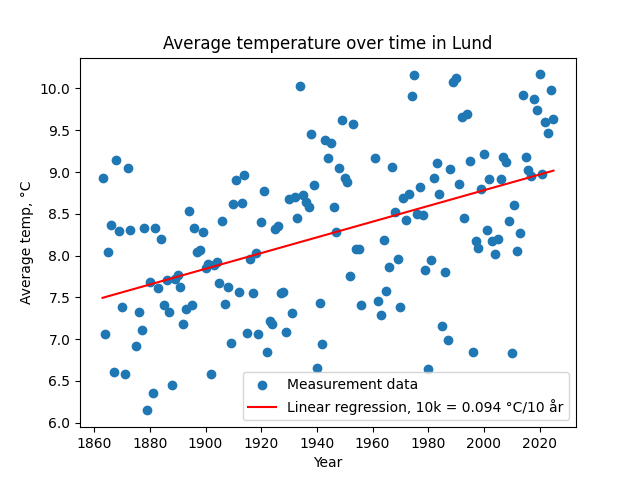

## Lund temperature trend

Project analyzes data from SMHI for a weather station in Lund using pandas, plotting temperature change over time. Temperatures have risen by about **0.094 °C per decade**.

In earlier years, 3 measurements were taken per day. That later changed to 2 per day, at slightly different times, which may affect the averages for the older years.

Data: [SMHI Open Data](https://www.smhi.se/data),

